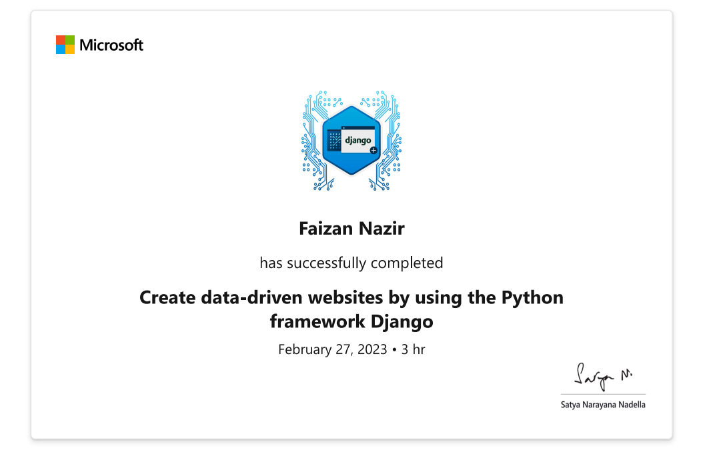

# [Create data-driven websites by using the Python framework Django](https://learn.microsoft.com/en-us/training/paths/django-create-data-driven-websites/)
 

# Use Django to create data-driven websites. 

## <li>In this learning path, you'll use Django to:

<ul>
<li> Build an app.
<li> Create and manage a database.
<li> Set up a superuser for the admin site.
<li> Use templates to create dynamic HTML pages.
<li> Design data-driven forms.
</ul>

 

## <li> Prerequisites
<ul>
<li>Intermediate knowledge of Python : 
<ul> 
<li>Package management</li> 
<li>
Inheritance and mix-ins</li>
<li>Intermediate understanding of HTML and CSS </li>
</li>
</ul>
 

 

# Modules
 

# [Module 1: Get Started with Django](https://learn.microsoft.com/en-us/training/modules/django-get-started/)
    
# `Learning objectives`
     
<ul>
<li>How to install Django. </li>
<li>Why Django is great for rapid deployments. </li>
<li>The difference between Django and Flask.  </li>
<li>The best types of applications for Django. </li>
<li>How to create a simple program. </li>
</ul>

***

# [Module 2: Work with models and data in Django](https://learn.microsoft.com/en-us/training/modules/django-models-data/)
    
# `Learning objectives`
     
<ul>
<li>Describe an object-relational mapping.  </li>
<li>Create a SQLite database in Django. </li>
<li>Create and activate Django models.  </li>
<li>Explain the purpose of the __str__ method in classes. </li>
<li>Create and query data in your database. </li>
</ul>

***

# [Module 3: Work with the Django admin site](https://learn.microsoft.com/en-us/training/modules/django-admin-site/)
    
# `Learning objectives`
     
<ul>
<li> Enable the Django admin site. </li>
<li> Create a superuser.</li>
<li> Add app models and access data. </li>
<li> Set user permissions.</li>
</ul>

***

# [Module 4: Create views and templates in Django](https://learn.microsoft.com/en-us/training/modules/django-views-templates/)

   
# `Learning objectives`
     
<ul>
<li> Work with views </li>
<li> Use template variables and tags</li>
<li> Add dynamic data to Django templates</li>
<li> Use template inheritance</li>
</ul>

***

# [Module 5: Use generic views in Django](https://learn.microsoft.com/en-us/training/modules/django-generic-views/)
    
# `Learning objectives`
     
<ul>
<li>Use generic views. </li>
<li>Create Django forms. </li>
<li>Use the django-crispy-forms library. </li>
</ul>

***

